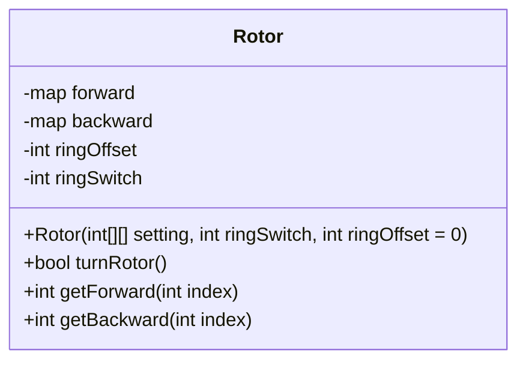

# Enigma Machine (Simulation)

Nicholas Norman, 2025

## Project Details

Language: C++, chosen for it's robust nature and fast searching, especially compared to Python.

Build platform: WSL, Ubuntu, using Makefile to handle compilation.

This project is going to be built into 2 sections,

* A simluated Enigma Machine, that can encode and decode (It is symmetric, meaning encoding and decoding are the same process).
* A "cracking" algorithm that, given ciphertext, can crack the enigma machine, giving us the plaintext and key(s) that were used.

## History

### Enimga

The Enimga machine has the cryptographic features:

* 3 out of 5 possible rotors to choose
* Reflector, mapping characters back through the rotors backwards
* A transpositional plugboard

Once a letter is pressed, the first rotor would spin. The letter pressed, for example B (1) would be sent through the first rotor, mapping to a new letter, ex. D (3). It would be mapped to a new letter for each rotor it went through, then would be mapped by a reflector, which would send the letter back through the rotors, following a reverse mapping, back to a similar area to the input, where it would light up a letter as the encoding.

An example of a real enigma machine, source: Wikipedia.

For a good example of the encryption process, play with this paper enigma, made by Mike Koss [https://mckoss.com/posts/paper-enigma/](https://mckoss.com/posts/paper-enigma/)

### Cracking

Alan turing, poland, ...

## Architecture

### Enigma

To similate the parts of the enigma, I have chosen to represent each feature as the following data structures.

Noting that each part (input, rotor, reflector, plug board) are all mappings, I am using a 2D integer array to store the mappings.

Each rotor will have a mapping such that some letter, represented by a number, will have a mapping to a new letter in the next rotor. Likewise, when moving backwards, they are reversed. To implement this I will be using maps and bidirectional maps (object) to store these values.

Note: The turnover is represented as the characters from 0-25, not their mappings. As well, when retreiving a letter, you must get the mapping, then subtract 1 from the final result to get the correct final mapping. Ex. Offset = 1, A->D, final result = D-1 = C.

The input, plugboard, and reflector are all one direction mappings and the rotors are bidirectional mapping.

For historical accuracy, the rotor and reflector settings will mimick real world enigma machines.

Each rotor will have a forward map, backward map, ring offset, and ring switch.
* `ringOffset` will store the offset of the current ring's mapping. So if the rotor has turned 3 times, the offset should be 3. The position of the mapping is `index - ringOffset` (mod 26).
* The `ringSwitch` tell the rotor where it should turn the next rotor in line. If the switch reaches 0 (`ringSwitch - ringOffset == 0`), it will turn the next rotor. This value is returned true or false from `TurnRotor`.
* `Rotor()` will set the rotor up. It takes a 2D array of integers and sets up the map based on `setting[i][0]` maps to `setting[i][1]`. Likewise it will do the reverse mapping. It will also set the `ringSwitch` and the `ringOffset`
* `turnRotor()` will add one to the current offset and returns true if the next rotor is ready to be rotated.
* `getForward(int index)` Takes the index of the mapping you are looking for and computes the true address via the ringOffset. It returns the mapped value from the forward map.
* `getBackward(int index)` Takes the index of the mapping you are looking for and computes the true address via the ringOffset. It returns the mapped value from the backward map.

#### Setup

1. Choose 3 out of the 5 rotors (I, II, III, IV, V)
2. Choose which order to put then in
3. Select an initial setting for each (A-Z), this is converted to a ring offset for the rotor.
4. Set plugboard settings by hand, file, or choose none (input maps to the same characters)
5. Choose to encrypt text from CLI or from a file
    * if from CLI, output to CLI
    * if from file, output to file

#### Algorithm

* void DisplayMenu()
* void SetupRotors()
* void SetupPlugboard()
* string Encrypt()
* string EncryptLetter()
* void saveFile()

### Cracking
